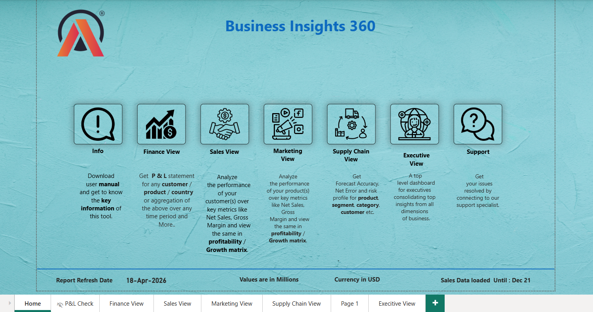
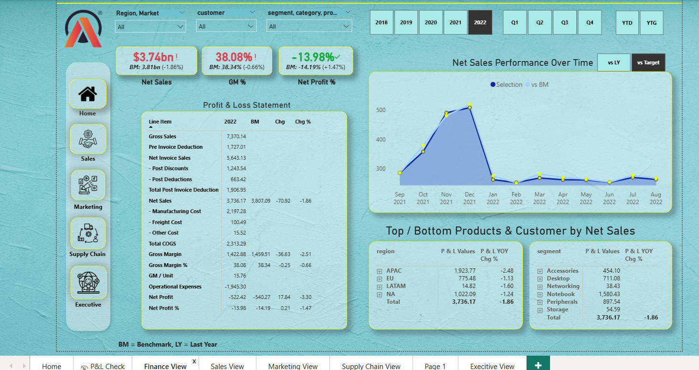
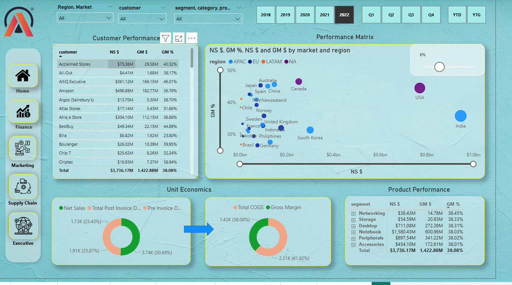
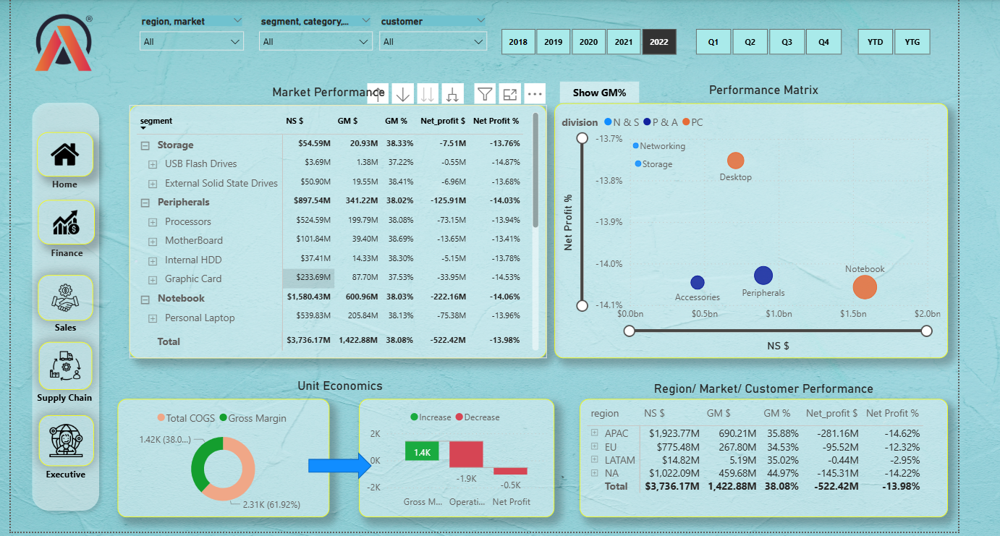
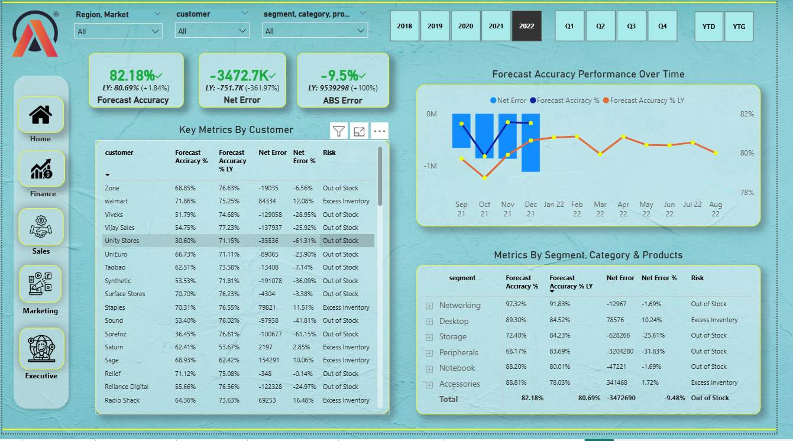

# 📊 Business Insights 360 — Power BI Dashboard

> An end-to-end executive dashboard built in Power BI, consolidating Finance, Sales, Marketing, and Supply Chain insights for leadership decision-making. Built on 1M+ rows of data using a star schema model with custom DAX measures.

---

## 🎯 Overview

**Business Insights 360** is a comprehensive BI solution that gives decision-makers a single source of truth across every major business function. Instead of juggling multiple reports, executives can explore company performance through four dedicated views — Finance, Sales, Marketing, and Supply Chain — all connected to the same underlying data model.

- **Data volume:** 1M+ rows
- **Time period:** 2018–2022 (with quarterly, YTD, and YTG breakdowns)
- **Currency:** USD (values in millions)
- **Coverage:** Multi-region (APAC, EU, LATAM, NA) across 25+ countries

---

## 🏠 Home Page

Landing page with navigation to every section of the report, including data refresh details and usage notes.

---

## 💰 Finance View

Complete Profit & Loss statement with KPI cards for Net Sales, Gross Margin %, and Net Profit %. Features Net Sales performance over time (vs Last Year and vs Target) and top/bottom products and customers by region and segment.

**Key metrics:** Gross Sales · Pre/Post Invoice Deductions · Net Sales · COGS · Gross Margin · Operational Expenses · Net Profit  
**Analysis dimensions:** Benchmark (BM) vs current year, YoY change, change %

---

## 📈 Sales View

Customer performance analysis with a geographic performance matrix showing GM% vs Net Sales by country. Unit economics funnel tracks Net Sales → COGS → Gross Margin flow, while product performance breaks down results by segment.

**Key visuals:** Customer ranking table · Bubble matrix (25+ countries) · Unit economics funnel · Product segment breakdown

---

## 🎯 Marketing View

Market performance by segment and category, with a division-level performance matrix and region/market/customer performance consolidated view. Unit economics waterfall shows Gross Margin → Operating Profit → Net Profit transitions.

**Key visuals:** Market performance tree table · Division performance matrix · Unit economics waterfall · Regional profit comparison

---

## 🚚 Supply Chain View

Forecast accuracy and risk analysis dashboard tracking Forecast Accuracy %, Net Error, and ABS Error against last year. Includes customer-level and segment-level metrics with risk classification (Out of Stock / Excess Inventory).

**Key visuals:** Forecast accuracy KPIs · Forecast accuracy performance over time · Key metrics by customer with risk flags · Metrics by segment, category & product

---

## 🛠️ Features

- **Star schema data model** — Fact tables (`fact_actuals_estimates`, `fact_forecast_monthly`) linked to dimension tables (`dim_customer`, `dim_date`, `dim_market`, `dim_product`)
- **Time intelligence:** Year (2018–2022), Quarter (Q1–Q4), YTD, and YTG filters
- **Multi-level filtering:** Region/Market, Customer, Segment/Category/Product
- **Custom navigation sidebar** with icons for each view (Home, Finance, Sales, Marketing, Supply Chain)
- **Benchmark comparisons:** vs Last Year (LY) and vs Target
- **Risk classification:** Out of Stock / Excess Inventory flags in Supply Chain
- **Consistent design system:** unified color palette, typography, and navigation across all pages

---

## 🧮 Key DAX Measures

- Net Sales (NS $)
- Gross Margin ($, %, per unit)
- Total COGS (Manufacturing + Freight + Other)
- Post Invoice Deductions / Pre Invoice Deductions
- Operational Expenses
- Net Profit ($, %)
- Forecast Accuracy % (current and LY)
- Net Error / ABS Error
- Market Share
- Target vs Actual variance

---

## 📁 Data Model

**Fact Tables**
- `fact_actuals_estimates` — actual sales and estimates
- `fact_forecast_monthly` — monthly forecast data

**Dimension Tables**
- `dim_customer` — customer master
- `dim_date` — date dimension with fiscal calendar
- `dim_market` — market and region hierarchy
- `dim_product` — product, category, segment hierarchy

**Supporting Tables**
- P&L Columns / P&L Rows (for financial statement layout)
- Fiscal Year
- Market Share · Operational Expenses · Manufacturing Cost · Freight Cost
- Target GM · Tolerance · NS GM Target

---

## 📝 Notes

- This dashboard was built using **practice data from a professional Power BI course** — no confidential or real company data is included. The goal was to demonstrate end-to-end BI capability: data modeling, DAX, UX design, and executive storytelling.
- The `.pbix` file is available on request — feel free to reach out on [LinkedIn](https://www.linkedin.com/in/ram-krishnaa-g-c-31136021b/).

---

## 👤 Author

**Ram Krishna G C**  
Sales & Operations Coordinator @ Arla Foods | Aspiring Data Analyst  
📍 Sharjah, UAE

[LinkedIn](https://www.linkedin.com/in/ram-krishnaa-g-c-31136021b/) · [GitHub](https://github.com/gcramkrishna01-gethub)

---

  <i>Turning raw data into decisions leadership can act on.</i>

